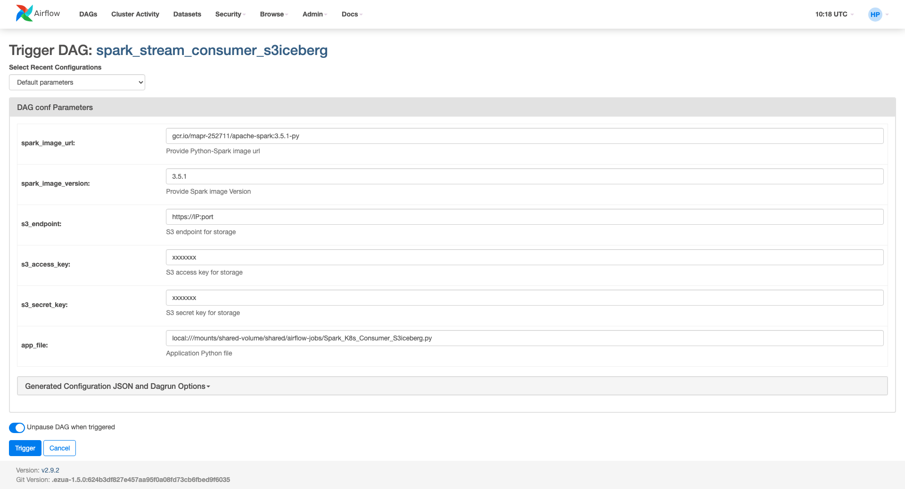
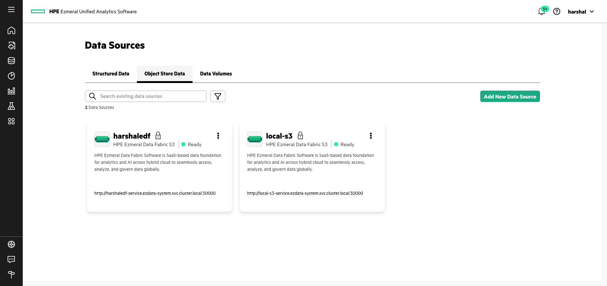

# Airflow

## Kafka Producer : Python 
[https://github.com/harshalpatilR/ezmeral/blob/main/Airflow/python_producer.py](https://github.com/harshalpatilR/ezmeral/blob/main/Airflow/python_producer.py) 

<br>

## Kafka Consumer : Spark Streaming

[https://github.com/harshalpatilR/ezmeral/blob/main/Airflow/spark_streaming_consumer_S3Iceberg.py](https://github.com/harshalpatilR/ezmeral/blob/main/Airflow/spark_streaming_consumer_S3Iceberg.py) 

This consumer accesses S3 via the parameters in the DAG as shown below. 



The same consumer can be changed to take the S3 credentials from a Kubernetes secret. The below change is required in YAML used with Spark Submit Operator. This can be used with HPE Spark images and Open Source Spark (OSS) images as well.

```yaml
 sparkConf:
 ...
 
    spark.hadoop.fs.s3a.endpoint: https://<IP Endpoint>:<port>
    spark.kubernetes.driver.secretKeyRef.AWS_ACCESS_KEY_ID: spark-oss-secret:AWS_ACCESS_KEY_ID
    spark.kubernetes.driver.secretKeyRef.AWS_SECRET_ACCESS_KEY: spark-oss-secret:AWS_SECRET_ACCESS_KEY
    spark.kubernetes.executor.secretKeyRef.AWS_ACCESS_KEY_ID: spark-oss-secret:AWS_ACCESS_KEY_ID
    spark.kubernetes.executor.secretKeyRef.AWS_SECRET_ACCESS_KEY: spark-oss-secret:AWS_SECRET_ACCESS_KEY

 ...

```


<br>

## Spark Submit with Unified Analytics S3 Proxy
[https://github.com/harshalpatilR/ezmeral/blob/main/Airflow/spark_submit_S3proxy.py](https://github.com/harshalpatilR/ezmeral/blob/main/Airflow/spark_submit_S3proxy.py) 

This method allows S3 connection via Ezmeral Unified Analytics S3 Proxy. This is a central place to manage S3 credentials. Once S3 data sources are enrolled, they all can be accessed with the url from S3 proxy along with SSO token from Unified Analytics. The YAML properties needed to make it work are below.




```yaml
 ...
 image: <HPE image such as gcr.io/mapr-252711/spark-py-3.5.1:v3.5.1.0.1>
 imagePullPolicy: Always
 imagePullSecrets:
   - imagepull
 sparkConf:
 ...
     spark.hadoop.fs.s3a.aws.credentials.provider: org.apache.spark.s3a.EzSparkAWSCredentialProvider
     spark.hadoop.fs.s3a.endpoint: http://<internal url such as harshaledf-service.ezdata-system.svc.cluster.local>:30000
 ...
```

<br>

## File Ingestion (CSV to Parquet) : Spark / Scala

[https://github.com/harshalpatilR/ezmeral/blob/main/Airflow/spark_submit_S3proxy.py](https://github.com/harshalpatilR/ezmeral/blob/main/Airflow/spark_submit_S3proxy.py) 

Only Scala JAR is available.


