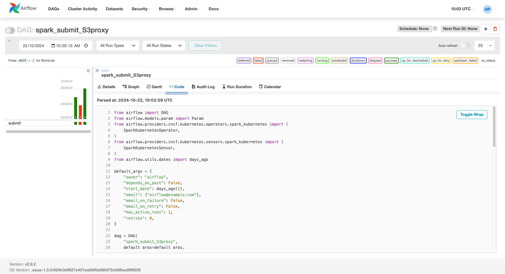

# Airflow

Dags Included 

 

## Kafka Producer : Python 
[https://github.com/harshalpatilR/ezmeral/blob/main/Airflow/python_producer.py](https://github.com/harshalpatilR/ezmeral/blob/main/Airflow/python_producer.py) 

 

## Kafka Consumer : Spark Streaming

[https://github.com/harshalpatilR/ezmeral/blob/main/Airflow/spark_streaming_consumer_S3Iceberg.py](https://github.com/harshalpatilR/ezmeral/blob/main/Airflow/spark_streaming_consumer_S3Iceberg.py) 

 

## Spark Submit with Unified Analytics S3 Proxy
[https://github.com/harshalpatilR/ezmeral/blob/main/Airflow/spark_submit_S3proxy.py](https://github.com/harshalpatilR/ezmeral/blob/main/Airflow/spark_submit_S3proxy.py) 

 

## File Ingestion (CSV to Parquet) : Spark / Scala

[https://github.com/harshalpatilR/ezmeral/blob/main/Airflow/spark_submit_S3proxy.py](https://github.com/harshalpatilR/ezmeral/blob/main/Airflow/spark_submit_S3proxy.py) 

Only Scala JAR is available.

