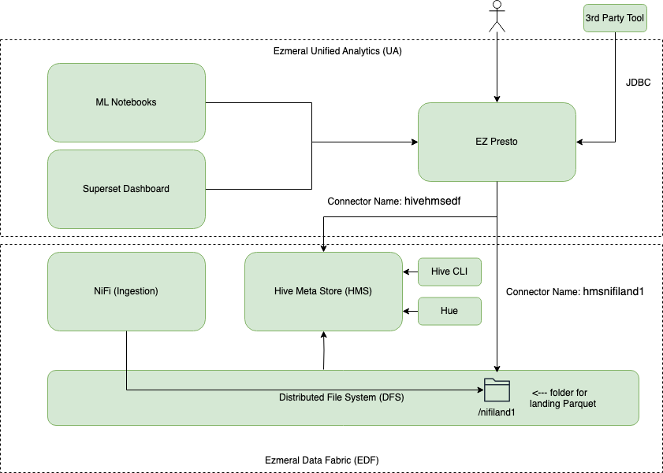
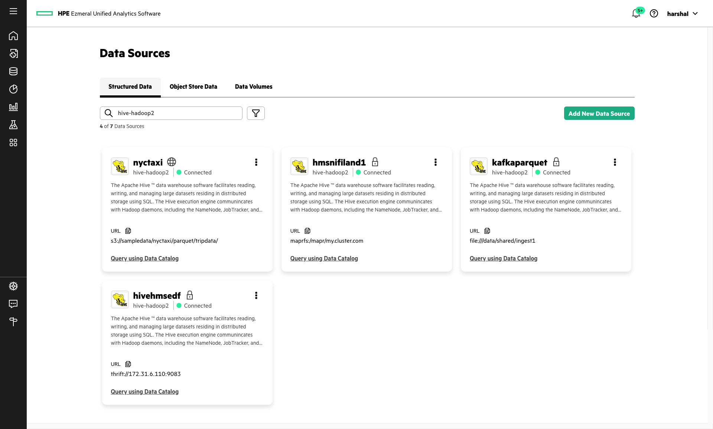
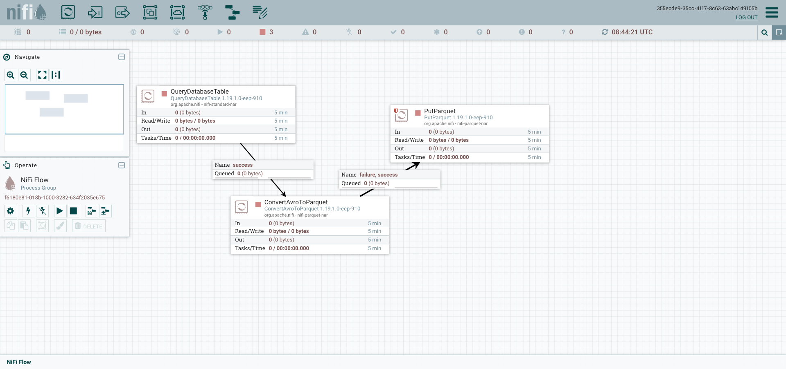
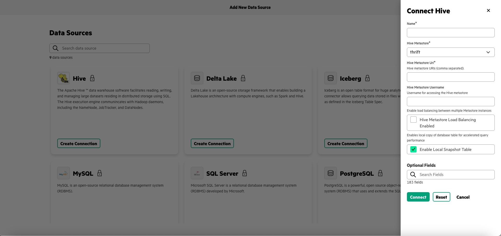
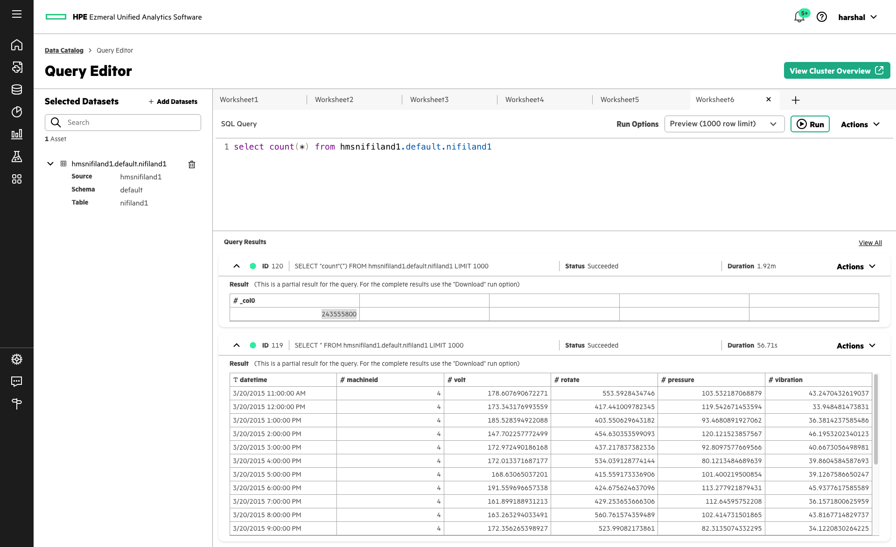
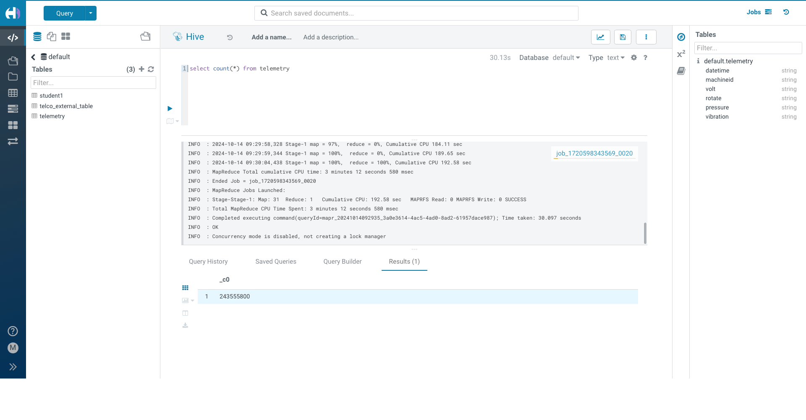
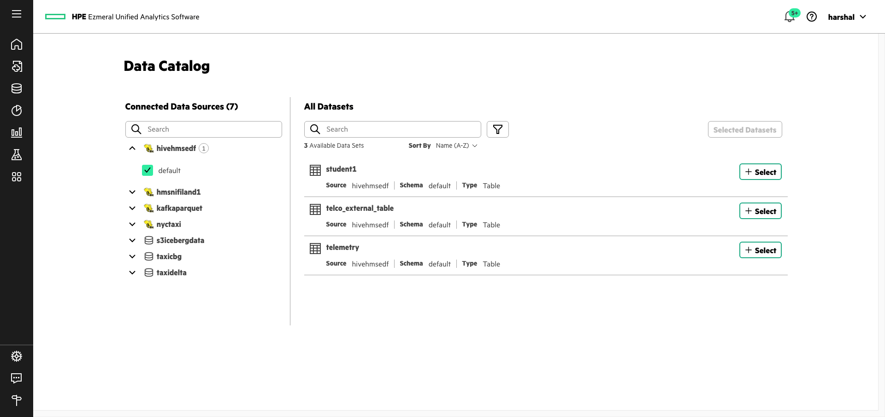
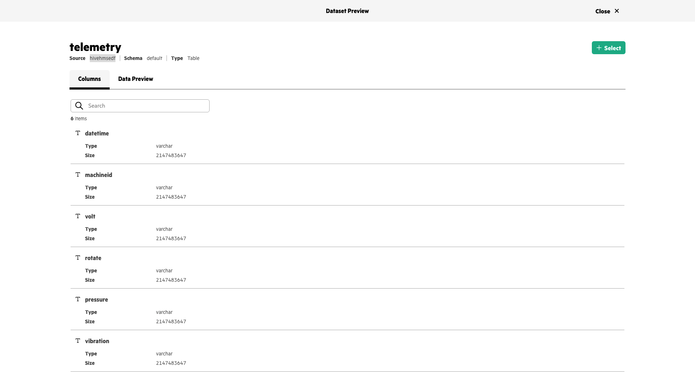
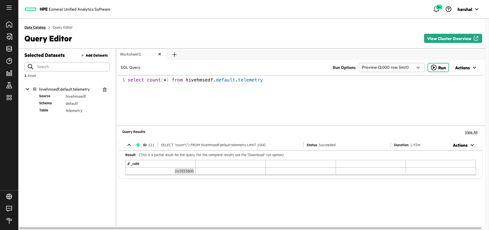

# EZPresto Data Source Connectors
## This document has connector details for EzPresto Connections 
#### The connectors are used to let Presto connect and federate query across these data sources. These connectors are automatically added via UI however some internal details are shown below.
#### UA 1.5 Presto connector: [https://prestodb.io/docs/0.287/connector/iceberg.html](https://prestodb.io/docs/0.287/connector/iceberg.html)

##### Hive Connector: 
##### It is a versatile connector that allows connectins to file-based data stores (Parquet based Hive tables, Iceberg tables etc.) as well as external Hive Metastores (such as those on traditional Hadoop clusters). 

<br>

**Architecture**

The solution architecture used in this document is shown here.



<br>

**Steps** 
 
1) Multiple ways to configure Hive connector are shown. 

* nyctaxi : Connect to Iceberg data on S3 object store
* hmsnifiland1 : Connect to Parquet data on Ezmeral Data Fabric file system
* kafkaparquet : Connect to Parquet data on Persistent Volume mapped to Ezmeral Unified Analytics
* hivehmsedf : Connect to Hive Metastore via Thrift protocol. The Hive Metastore is running on Ezmeral Data Fabric. The Hive Metastore also then allows accessing file based Hive tables stored on Ezmeral Data Fabric file system




<br> 

2) Lets look at how the connectivity works. We have a NiFi Flow that persists data to distributed file system folder. Both the NiFi flow and the distributed file system folder listings are shown below. This is the data we need to connect to Presto.



The flow lands data which can be checked via standard Hadoop commands.

```bash
$ hadoop fs -ls /nifiland1 

Found 278 items
-rwxr-xr-x   3 mapr mapr   29640681 2024-07-25 13:35 /nifiland1/00dd38a1-bb80-46aa-aa4f-a75bbb974207.parquet
-rwxr-xr-x   3 mapr mapr   29640681 2024-07-25 08:56 /nifiland1/00e2cdbc-61bf-4d5b-83a6-47c25e0de710.parquet
-rwxr-xr-x   3 mapr mapr   29640681 2024-07-25 10:48 /nifiland1/0143bf87-ec71-42f6-aeab-c790f6039211.parquet
-rwxr-xr-x   3 mapr mapr   29640681 2024-07-25 11:47 /nifiland1/035c5c35-77e8-4f3f-abd8-bc8f9448c8bd.parquet
-rwxr-xr-x   3 mapr mapr   29640681 2024-07-25 10:42 /nifiland1/058b06f7-7840-456e-832a-1e538027d418.parquet
-rwxr-xr-x   3 mapr mapr   29640681 2024-07-25 09:57 /nifiland1/05d43447-a5c4-43ef-9e4f-e0d30ea97d09.parquet
-rwxr-xr-x   3 mapr mapr   29640681 2024-07-25 09:58 /nifiland1/06cb874e-5d78-4b73-b1ef-d5f40542db71.parquet
-rwxr-xr-x   3 mapr mapr   29640681 2024-07-25 13:26 /nifiland1/08254d47-9ff1-4008-b3da-7a659e27dca5.parquet

```
Further data ingestion will result in increase in records of this table via addition on new Parquet files into the same directory that defines the Hive table.

We use Ezmeral Unified Analytics user interface to provide parameters necessary to connect to this source from Presto. The underlying values are shown below. Presto connectors are created via Ezmeral Unified Analytics User Interface. The configs saved as part of these connectors can be found inside Presto Master Pods.




These connector settings are taken from the Presto Master Pod in Ezmeral Unified Analytics

```bash
$ kubectl exec -it ezpresto-sts-mst-0 -n ezpresto -- /bin/bash

logged into Presto Master container
$ cd /etc/presto/catalog

```


```bash
$ cat hmsnifiland1.properties
 
#adding catalog using endpoint
#Mon Oct 14 07:50:44 UTC 2024
hive.hdfs.authentication.type=MAPRSASL
hive.metastore.authentication.type=MAPRSASL
connector.name=hive-hadoop2
file.type=PARQUET
df.cluster.name=my.cluster.com
data.dir=maprfs\:/mapr/my.cluster.com
hive.config.resources=/etc/presto/catalog/hmsnifiland1/hive.config.resources.config
hive.metastore=discovery
hive.storage-format=PARQUET

```

```bash
$ cat /etc/presto/catalog/hmsnifiland1/hive.config.resources.config
<configuration> 
<property> 
    <name>fs.defaultFS</name> 
    <value>maprfs://my.cluster.com/</value> 
</property> 
</configuration> 

```
```bash
$ cd maprconf
$ cat mapr-clusters.conf
my.cluster.com secure=true 172.31.6.110:7222
cat maprtickets 
my.cluster.com <ticket details>

```

With the above config behind the Presto connector in-place, we can go to Presto UI and try out some queries on this table - and we see the record count in this NiFi ingestion table.



We do have Hue running on Ezmeral Data Fabric. With this, we can run a tranditional Hive query that gets run on Map-Reduce. This shows the exact same record count for this table as we observed from Presto. So, the connectivity to Presto is established correctly.



<br>

3) To connect to the same data source but via Hive Metastore, configs are as below. These configs are taken directly from Presto Master Pod. However, the config is entered via Ezmeral Unified Analytics User Interface.

Table definition in Hive Metastore for this NiFi ingestion table is as below. If we connect to Hive Metastore via Thrift and access this table then this table name and this table definition will be used. If we directly connect to the folder with Parquet files then the schema stored in Parquet files themselves is used.

```sql
1 CREATE EXTERNAL TABLE `default.telemetry`(
2	  `datetime` string, 
3	  `machineid` string, 
4	  `volt` string, 
5	  `rotate` string, 
6	  `pressure` string, 
7	  `vibration` string)
8	ROW FORMAT SERDE 
9	  'org.apache.hadoop.hive.ql.io.parquet.serde.ParquetHiveSerDe' 
10	STORED AS INPUTFORMAT 
11	  'org.apache.hadoop.hive.ql.io.parquet.MapredParquetInputFormat' 
12	OUTPUTFORMAT 
13	  'org.apache.hadoop.hive.ql.io.parquet.MapredParquetOutputFormat'
14	LOCATION
15	  'maprfs:/mapr/my.cluster.com/nifiland1'
```

We are able to see the Hive Metastore tables via Presto on Ezmeral Unified Analytics.



We are able to query the Hive Metastore tables via Presto on Ezmeral Unified Analytics.


If we go to Hive CLI on Ezmeral Data Fabric then we can access the same table and query it. We can confirm that the record counts in this table match with the record counts from Presto query on this same table. 

```sql
$ hive
 
hive> show schemas;
OK
default
Time taken: 0.545 seconds, Fetched: 1 row(s)
hive> show tables;
OK
student1
telco_external_table
telemetry
Time taken: 0.157 seconds, Fetched: 3 row(s)
hive> select count(*) from default.telemetry;
Query ID = mapr_20241022063242_80151c80-bd2e-4e93-8b97-448cc7c6bdd5
Total jobs = 1
Launching Job 1 out of 1
Number of reduce tasks determined at compile time: 1
In order to change the average load for a reducer (in bytes):
  set hive.exec.reducers.bytes.per.reducer=<number>
In order to limit the maximum number of reducers:
  set hive.exec.reducers.max=<number>
In order to set a constant number of reducers:
  set mapreduce.job.reduces=<number>
Starting Job = job_1720598343569_0021, Tracking URL = https://ip-172-31-6-110.us-east-2.compute.internal:8090/proxy/application_1720598343569_0021/
Kill Command = /opt/mapr/hadoop/hadoop-3.3.5/bin/mapred job  -kill job_1720598343569_0021
Hadoop job information for Stage-1: number of mappers: 31; number of reducers: 1
2024-10-22 06:32:51,989 Stage-1 map = 0%,  reduce = 0%
2024-10-22 06:32:59,282 Stage-1 map = 6%,  reduce = 0%, Cumulative CPU 12.77 sec
2024-10-22 06:33:00,313 Stage-1 map = 10%,  reduce = 0%, Cumulative CPU 18.21 sec
2024-10-22 06:33:01,340 Stage-1 map = 26%,  reduce = 0%, Cumulative CPU 47.37 sec
2024-10-22 06:33:02,370 Stage-1 map = 35%,  reduce = 0%, Cumulative CPU 64.66 sec
2024-10-22 06:33:04,436 Stage-1 map = 48%,  reduce = 0%, Cumulative CPU 89.18 sec
2024-10-22 06:33:05,461 Stage-1 map = 55%,  reduce = 0%, Cumulative CPU 101.54 sec
2024-10-22 06:33:06,483 Stage-1 map = 77%,  reduce = 0%, Cumulative CPU 146.85 sec
2024-10-22 06:33:07,506 Stage-1 map = 94%,  reduce = 0%, Cumulative CPU 176.02 sec
2024-10-22 06:33:08,526 Stage-1 map = 100%,  reduce = 0%, Cumulative CPU 186.57 sec
2024-10-22 06:33:13,634 Stage-1 map = 100%,  reduce = 100%, Cumulative CPU 189.58 sec
MapReduce Total cumulative CPU time: 3 minutes 9 seconds 580 msec
Ended Job = job_1720598343569_0021
MapReduce Jobs Launched: 
Stage-Stage-1: Map: 31  Reduce: 1   Cumulative CPU: 189.58 sec   MAPRFS Read: 0 MAPRFS Write: 0 SUCCESS
Total MapReduce CPU Time Spent: 3 minutes 9 seconds 580 msec
OK
243555800
Time taken: 32.488 seconds, Fetched: 1 row(s)
hive> 
```
<br>
Below configs are taken from Presto Master pod that show how Presto connects to Hive.

```bash
$ kubectl exec -it ezpresto-sts-mst-0 -n ezpresto -- /bin/bash

logged into Presto Master container
$ cd /etc/presto/catalog

```

```bash
$ cat hivehmsedf.properties 

#adding catalog using endpoint
#Fri Oct 04 07:35:07 UTC 2024
hive.hdfs.authentication.type=MAPRSASL
hive.metastore.uri=thrift\://172.31.6.110\:9083
hive.metastore.authentication.type=MAPRSASL
connector.name=hive-hadoop2
df.cluster.name=my.cluster.com
hive.config.resources=/etc/presto/catalog/hivehmsedf/hive.config.resources.config
hive.metastore=thrift
df.cluster.details=my.cluster.com secure\=true 172.31.6.110\:7222
hive.hdfs.df.ticket=my.cluster.com <ticket details>

```

```bash
$ cd hivehmsedf
$ cat hive.config.resources.config 

<configuration> 
<property> 
    <name>fs.defaultFS</name> 
    <value>maprfs://my.cluster.com/</value> 
</property> 
</configuration> 

```

```bash
$ cd maprconf
$ cat mapr-clusters.conf

my.cluster.com secure=true 172.31.6.110:7222
cat maprtickets 
my.cluster.com <ticket details>

```


