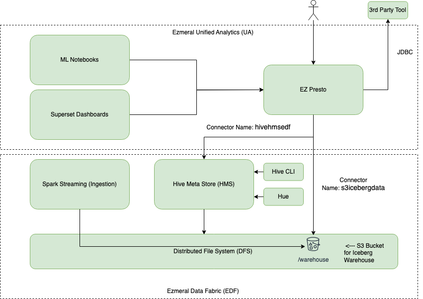
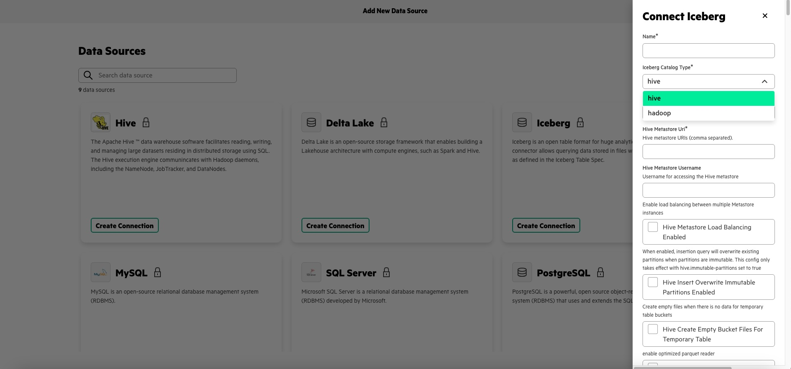
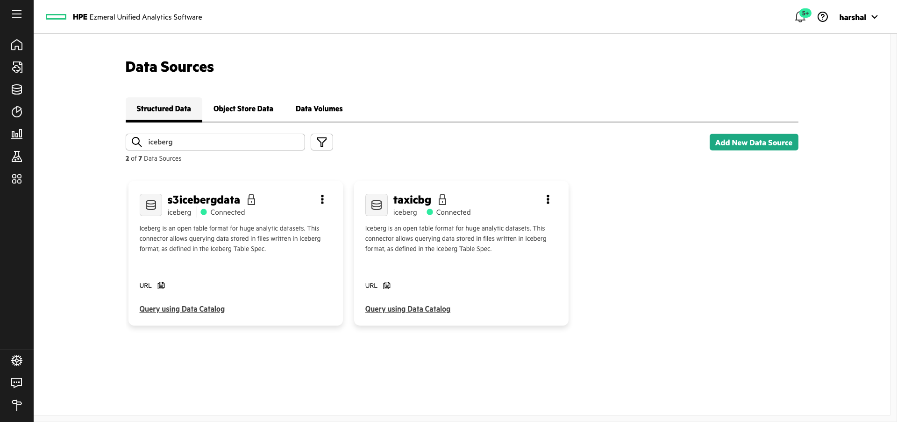
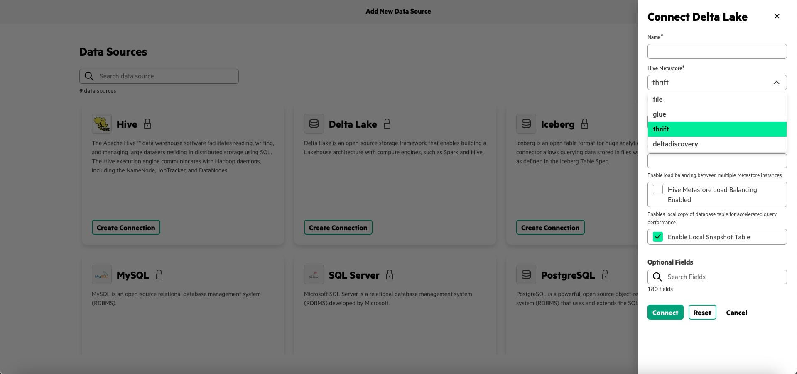
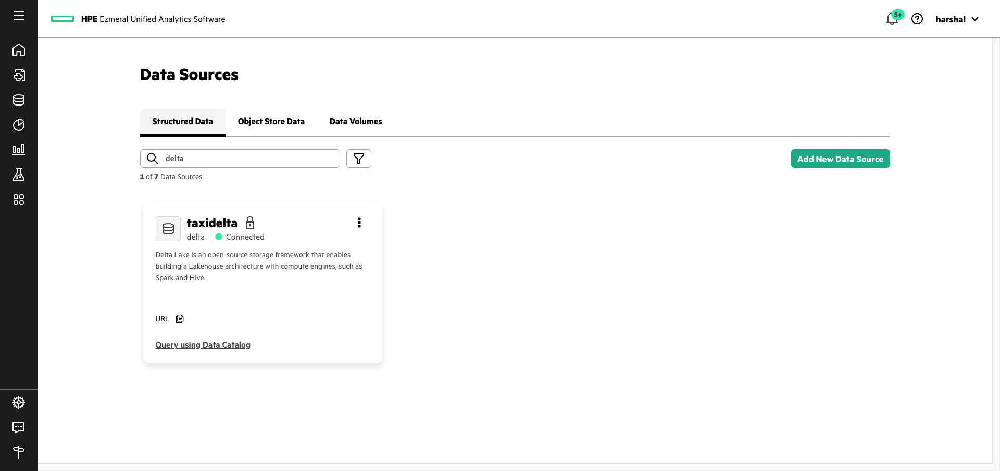

# EZPresto Iceberg Operations
## This document shows query operations with EZPresto 
#### Read the file ingested via Python Producer to Kafka to Spark Structured Streaming to EDF / Iceberg to UA Presto
#### UA 1.5 Presto connector: [https://prestodb.io/docs/0.287/connector/iceberg.html](https://prestodb.io/docs/0.287/connector/iceberg.html)
<br>
<br>

Configuration details of the Presto connector to Iceberg warehouse are included below.

<br>

**Architecture**

The solution architecture used in this document is shown here. The Presto connection details are described from point 5 onwards.


<br>

**Steps** 

1) After each ingestion, the counts will keep increasing. Check streaming counts are ok. 


```sql
select count(*) as num_records from dficeberg.default.kafka_ingest3
```


<br>
<br>

2) Ensure select works on the stream ingestion table. We should be able to select recrods from this table.

```sql
select * from dficeberg.default.kafka_ingest3
```


<br>
<br>


3) Ensure snapshots are visible. It is indeed Iceberg table.

```sql
select made_current_at, cast(snapshot_id as varchar) as snapshot, cast(parent_id as varchar) as parent, is_current_ancestor from dficeberg.default."kafka_ingest3$history"
```


<br>
<br>

4) Check time-travel by using the first snapshot created after append of 1st record to the Iceberg table. You should get only 1 record in the output.

```sql
select * from dficeberg.default.kafka_ingest3 FOR VERSION AS OF 1431105276184260366
```


<br>
<br>

5) Iceberg Connector can be configured via Ezmeral Unified Analytics UI.


Once added, the connector becomes active and can be used as data source to run Presto queries.


This connector details can be checked via Presto Master Pod. The specific configurations are provided below.

```bash
$ cat s3icebergdata.properties

#adding catalog using endpoint
#Thu Sep 26 09:54:32 UTC 2024
hive.s3.path-style-access=true
hive.s3.aws-secret-key=<xxx>
hive.s3.aws-access-key=<xxx>
iceberg.catalog.cached-catalog-num=10
hive.s3.endpoint=https\://<IP>\:9000
iceberg.hadoop.config.resources=/etc/presto/catalog/s3icebergdata/iceberg.hadoop.config.resources.config
connector.name=iceberg
hive.s3.ssl.enabled=false
iceberg.catalog.warehouse=s3\://icebergdata/warehouse
iceberg.catalog.type=hadoop
```
```bash
$ cat /etc/presto/catalog/s3icebergdata/iceberg.hadoop.config.resources.config

<?xml version="1.0" encoding="UTF-8"?>
<?xml-stylesheet type="text/xsl" href="configuration.xsl"?>

<configuration>        
    <property>
        <name>presto.s3.ssl.enabled</name>
        <value>false</value>
    </property>

    <property>
        <name>presto.s3.access-key</name>
        <value><xxxx></value>
    </property>

    <property>
        <name>presto.s3.secret-key</name>
        <value><xxxx></value>
    </property>

    <property>
        <name>presto.s3.endpoint</name>
        <value>https://<IP>:<Port></value>
    </property>

    <property>
        <name>presto.s3.path-style-access</name>
        <value>true</value>
    </property>
    
    <property>
        <name>fs.s3.impl</name>
        <value>com.facebook.presto.hive.s3.PrestoS3FileSystem</value>
    </property>

    <property>
        <name>fs.s3a.impl</name>
        <value>com.facebook.presto.hive.s3.PrestoS3FileSystem</value>
    </property>
```
<br>
<br>
6) Similarly, Delta-Lake connector can be configured to connect to Delta-Lake tables as well. 



Once added, the connector becomes active and can be used a data source to run Presto queries.



The details on configuration taken from Presto Master Pod are as below.

```bash
[presto@ezpresto-sts-mst-0 catalog]$ cat taxidelta.properties

#adding catalog using endpoint
#Fri Sep 13 15:51:51 UTC 2024
hive.s3.path-style-access=true
hive.hdfs.presto.principal=presto
hive.s3.aws-secret-key=<xxxx>
hive.s3.aws-access-key=<xxxx>
hive.s3.endpoint=https\://<IP>\:9000
connector.name=delta
hive.s3.ssl.enabled=false
hive.metastore=deltadiscovery
delta.datadir=s3\://delta/taxidelta/
```
