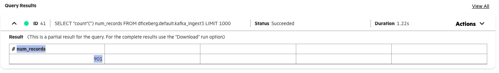
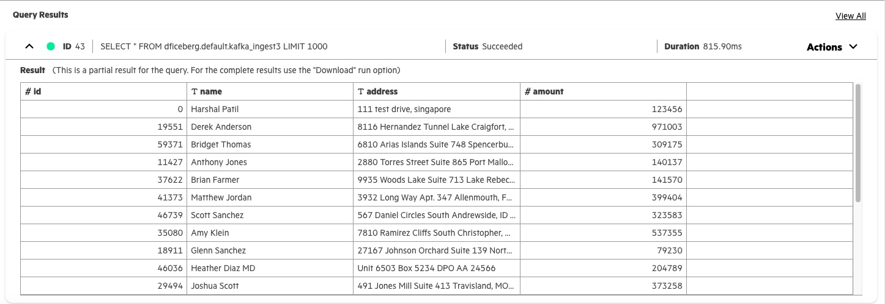
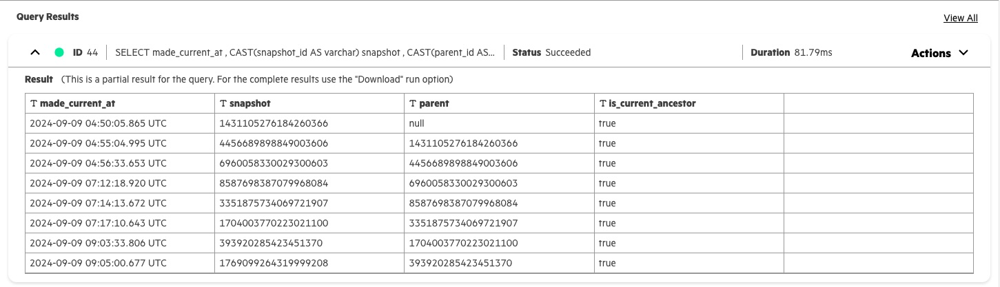
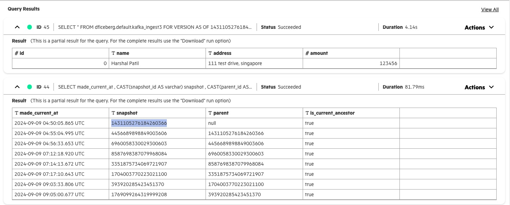

# EZPresto Iceberg Operations
## This document shows query operations with EZPresto 
#### Read the file ingested via Python Producer to Kafka to Spark Structured Streaming to EDF / Iceberg to UA Presto
#### UA 1.5 Presto connector: [https://prestodb.io/docs/0.287/connector/iceberg.html](https://prestodb.io/docs/0.287/connector/iceberg.html)

1) After each ingestion, the counts will keep increasing. Check streaming counts are ok. 


```sql
select count(*) as num_records from dficeberg.default.kafka_ingest3
```



2) Check select works on the stream ingestion table. We should be able to select recrods from this table.

```sql
select * from dficeberg.default.kafka_ingest3
```



3) Check snapshots are visible. It is indeed Iceberg table.

```sql
select made_current_at, cast(snapshot_id as varchar) as snapshot, cast(parent_id as varchar) as parent, is_current_ancestor from dficeberg.default."kafka_ingest3$history"
```



4) Check time-travel by using the first snapshot created after append of 1st record to the Iceberg table. You should get only 1 record in the output.

```sql
select * from dficeberg.default.kafka_ingest3 FOR VERSION AS OF 1431105276184260366
```


