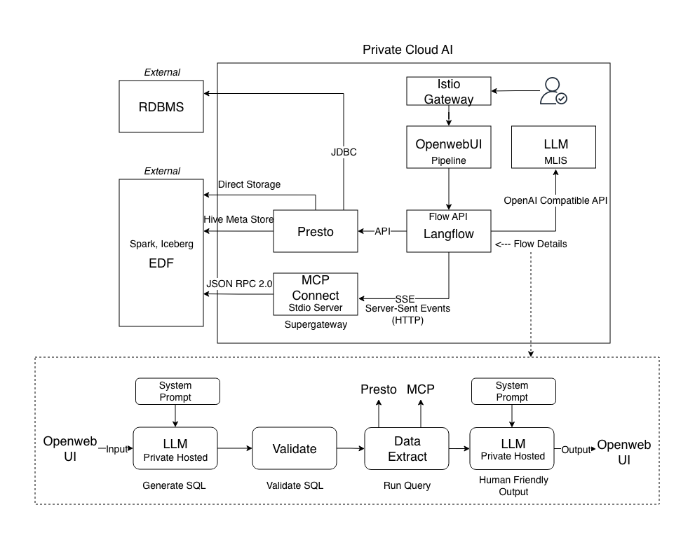
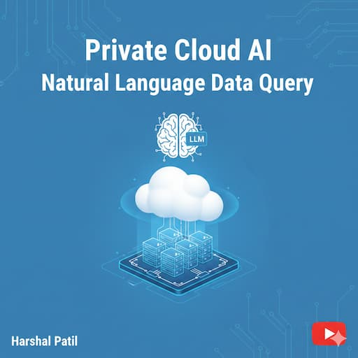
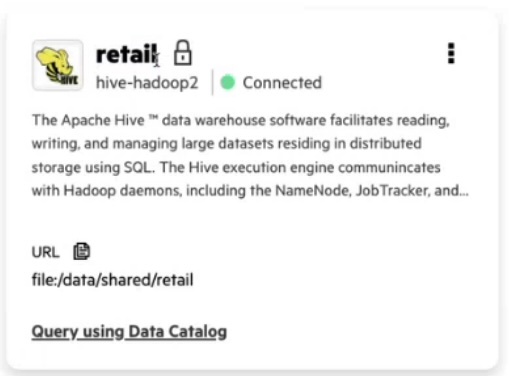
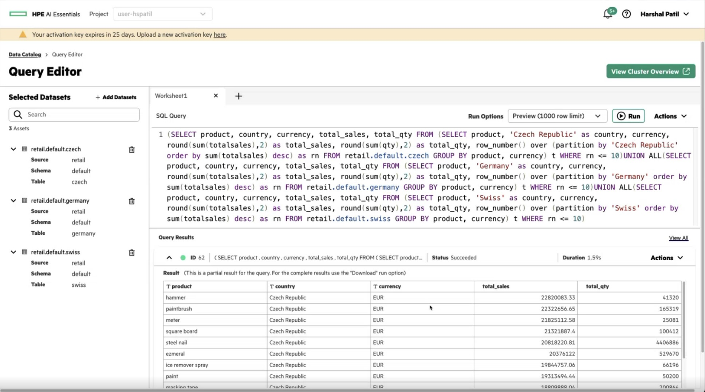
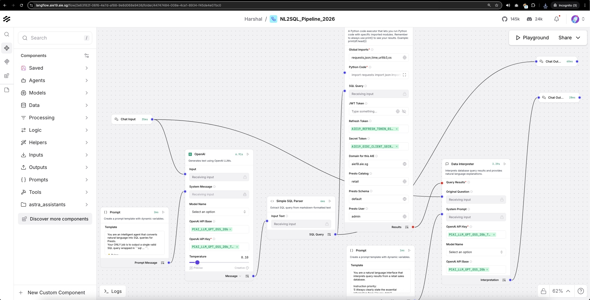
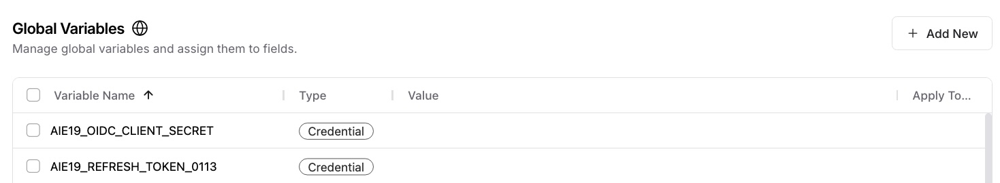
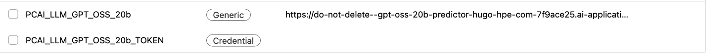
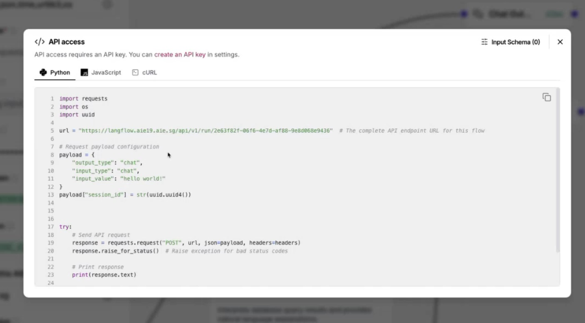
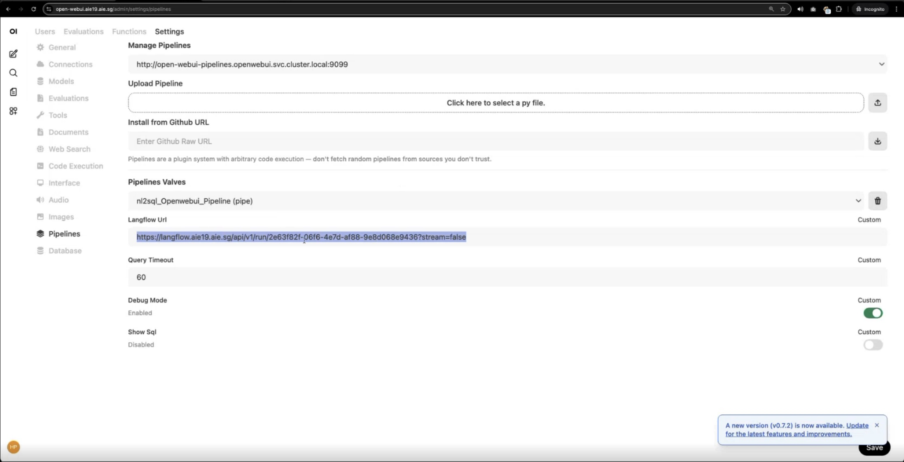
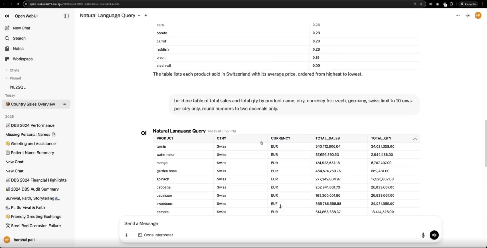

# Natural Language Data Query on HPE Private Cloud AI 

## Purpose

Power of Agentic AI is enabling use-cases that allow Conversational AI frontend for asking questions and getting answers based on datasets stored in RDBMS and Big Data Systems. The users simply use natural language and ask business questions, while GenAI translates them into necessary SQL, executes against necessary data storage, interprets results and then responds to user query. 

## Architecture

This diagram shows the Architecture of the system. The solution leverages frameworks inside Private Cloud AI. The integrations across frameworks are already done which makes this complex end-end workflow possible.

## Demo

Click thumbnail or the link below.

[Demo: Natural Language Data Query](https://youtu.be/YurtTt_3xC8)

## Scripts

Use the below files:

[NL2SQL Flow](natural_language_query/92_NL2SQL_Pipeline_2026.json)

[OpenwebUI Pipeline](natural_language_query/92_nl2sql_Openwebui_Pipeline.py)

## Process Overview

| Step | Action | Description |
| :--- | :--- | :--- |
| **Step 1** | Deploy Data Connections | Configure data connection either in Presto or via MCP server |
| **Step 2** | Deploy Langflow Flow | Deploy Langflow and make sure it runs |
| **Step 3** | Deploy OpenwebUI Pipeline | Enable OpenwebUI pipeline to talk to Langflow API endpoint |
| **Step 4** | Query data | Use natural language questions & get answers |
---

## Step 1: Add Data Connection

Use Preto to connect to RDBMS or Big Data System with data source. For the purpose of demo, a big data source is simulated with retail data in Parquet format. The connection to this data is established via Hive connector in Presto. 

After data connection, the data appears in Presto catalog and can be queried by writing SQL. 

MCP connections will be covered in a seperate receipe.

## Step 2: Deploy Langflow Flow

Langflow NL2SQL Flow can be uploaded into Langflow framework. 

The flow uses OpenAI Compatible Locally Hosted LLM on Private Cloud AI. So while the functional block used is OpenAI LLM, the actual model endpoint URL and model token are from Private Cloud AI inference deployment service.

The flow uses Global Variables defined in Langflow to protect sensitive information such as API keys, refresh and security keys etc. These must be defined prior to running the flow.

The flow has a share button which shows the API endpoint to call the flow. This API endpoint is required to be configured in OpenwebUI pipeline.

## Step 3: Deploy OpenwebUI pipeline

OpenwebUI pipeline includes a number of valves - which are configurable parameters. Key parameter is the API endpoint of the Langflow Flow deployed in earlier step.

Once the pipeline is configured, then OpenwebUI has a preconfigured Natural Language Query which can be used to ask natural language questions and get relevant responses in Conversational AI format.

 

