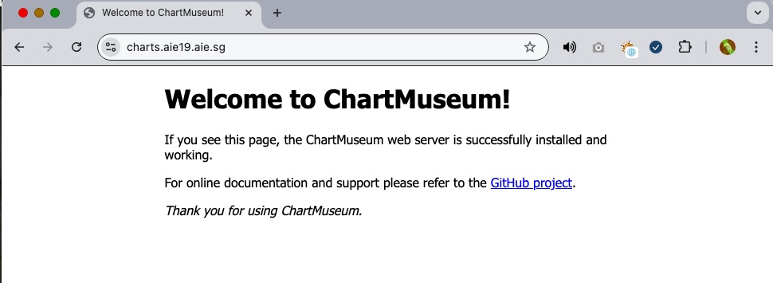

# Expose Chartmuseum in HPE Private Cloud AI 

## Purpose

HPE Private Cloud AI includes Chartmuseum as Helm Chart repo. This receipe describes how to expose Chartmuseum to be accessed from outside. The purpose is to enable backup of helm charts from a system outside the appliance.

## Process Overview

| Step | Action | Description |
| :--- | :--- | :--- |
| **Step 1** | Deploy Virtual Service | Deploy yaml via Admin access at Kubernetes layer |
| **Step 2** | Access Chartmuseum UI | Check Chartmuseum UI |
| **Step 3** | Connect with Helm CLI | Use Helm CLI from external system |
---

## Step 1: Deploy Virtual Service

Kubernetes Admin may deploy a Virtual Service at Istio Gateway to enable access to Chartmuseum from outside the appliance. 


Yaml may be formulated based on the below example.

```yaml
### Virtual Service Yaml

apiVersion: networking.istio.io/v1
kind: VirtualService
metadata:
  name: chartmuseum-vs
  namespace: ezdata-system
spec:
  gateways:
  - istio-system/ezaf-gateway
  hosts:
  - charts.aie19.aie.sg #### CHANGE
  http:
  - match:
    - uri:
        prefix: /
    route:
    - destination:
        host:  chartmuseum.ez-chartmuseum-ns.svc.cluster.local ### VERIFY
        port:
          number: 8080 ### VERIFY

### end
```

## Step 2: Access Chartmuseum UI

Once Virtual Service deployed, Chartmuseum UI is accessible. The subdomain will be the one configured in the Yaml file.



Chart may be downloaded by URL such as below:

```bash
https://charts.aie19.aie.sg/charts/langflow-ide-0.1.1.tgz

```

## Step 3: Connect via external system using Helm CLI

Use Helm CLI from external system to connect, list and download charts inside appliance.

```bash
ext-system$ helm repo add aie19 https://charts.aie19.aie.sg/ --insecure-skip-tls-verify

** list helm charts and if required download them for reference 

ext-system$ helm search repo aie19 

 NAME                      CHART VERSION APP VERSION                     DESCRIPTION                                       
 aie19/airbyte             0.55.5        0.52.0                          Helm chart to deploy airbyte                      
 aie19/airflow             1.7.4         2.10.5                          Hewlett Packard Enterprise Airflow Helm.          
 aie19/appsmith            3.6.4                                         Appsmith is an open source framework to build a...
 aie19/bar                 0.1.0         1.0.0                           Batch Agreement Robot - AI-powered batch docume...
 aie19/cloudflared         1.7.1         2025.5.0                        Kubito Cloudflared (Argo Tunnel) Helm Chart       
 aie19/ezpresto            1.9.0         1.9.0-prestodb-0.289            Distributed query engine designed for analytic ...
 aie19/ezua-tutorials      1.9.0         1.9.0                                                                             
 aie19/gradio-vlm-chart    0.1.0         0.0.1                           A Helm chart for deploying the Gradio VLM strea...
 aie19/hpe-mlis            1.9.1         1.9.1                           A Helm chart for AI On-Line Inferencing (Aioli)   
 aie19/hpe-spark-operator  1.3.38        1.3.8-202503251142              A Helm chart for HPE Spark on Kubernetes operator 
 aie19/kubeflow            1.4.24        1.9.1                           Hewlett Packard Enterprise Kubeflow Helm.         
 aie19/kuberay             0.5.8         2.44.1                          A Helm chart for Kubernetes                       
 aie19/langflow-ide        0.1.1         1.4.2                           Helm chart for Langflow IDE                       
 aie19/livy                0.6.21        0.8.0.101                       A Helm chart for Apache Livy                      
 aie19/mlflow              0.7.41        2.22.0                          A Helm chart for Mlflow open source platform fo...
 aie19/n8n                 0.1.4         1.0.4                           n8n Workflow Automation Helm Chart                
 aie19/openmetadata        1.2.702       1.2.4                           A Helm chart for OpenMetadata on Kubernetes       
 aie19/pebblo-stack        0.1.2         0.6.8-pebblo-rel-0.6-ba1c5d21b  A Helm chart for Pebblo AI Stack with all 15 se...
 aie19/sparkhs             0.6.25        3.5.5.2                         A Helm chart for Spark History Server             
 aie19/superset            0.12.8        4.1.2                           Apache Superset is a modern, enterprise-ready b...
 aie19/vanna-ai            0.0.3         1.17.0                          A Helm chart for Vanna AI                         
 aie19/vision-agent        0.2.0         0.2.0                           Helm chart for the Gradio vision agent app        

** these are all helm charts inside PCAI appliance 
** download any reqd chart for backup

ext-system$ helm pull aie19/n8n --insecure-skip-tls-verify
** download is complete and you have backup of helm chart in PCAI appliance 

```

