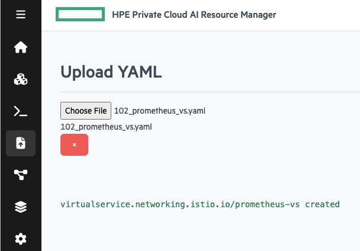
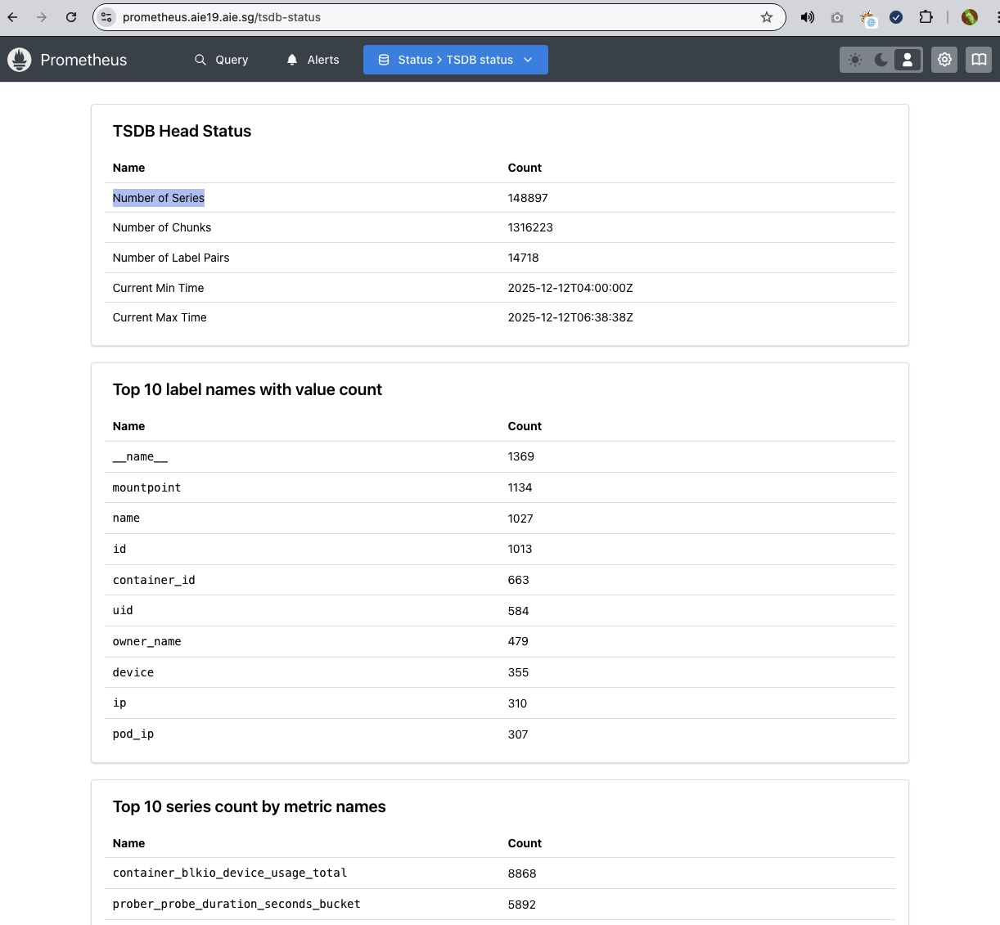
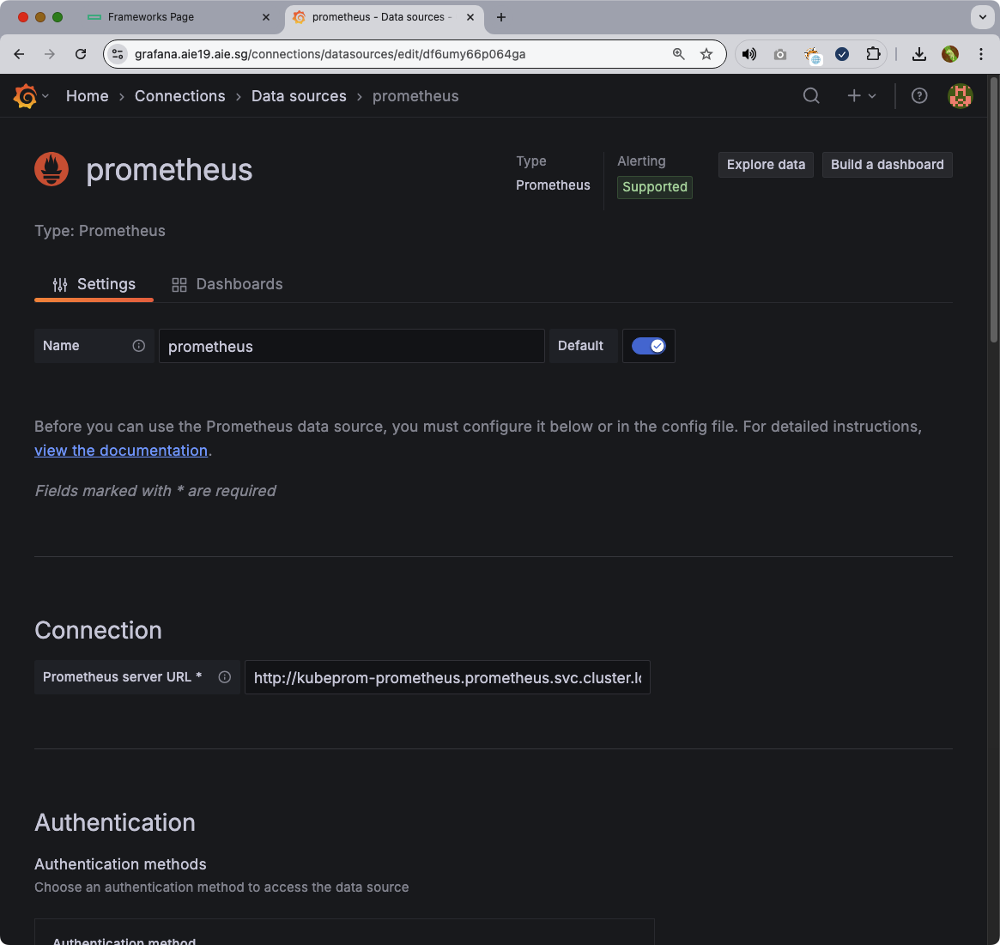
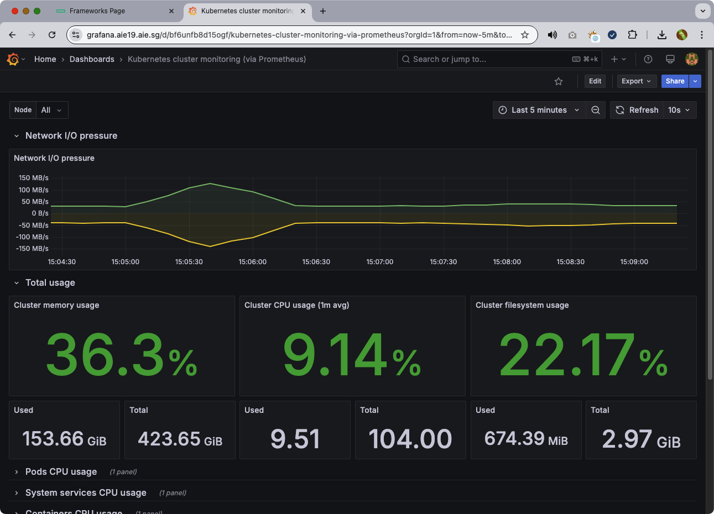
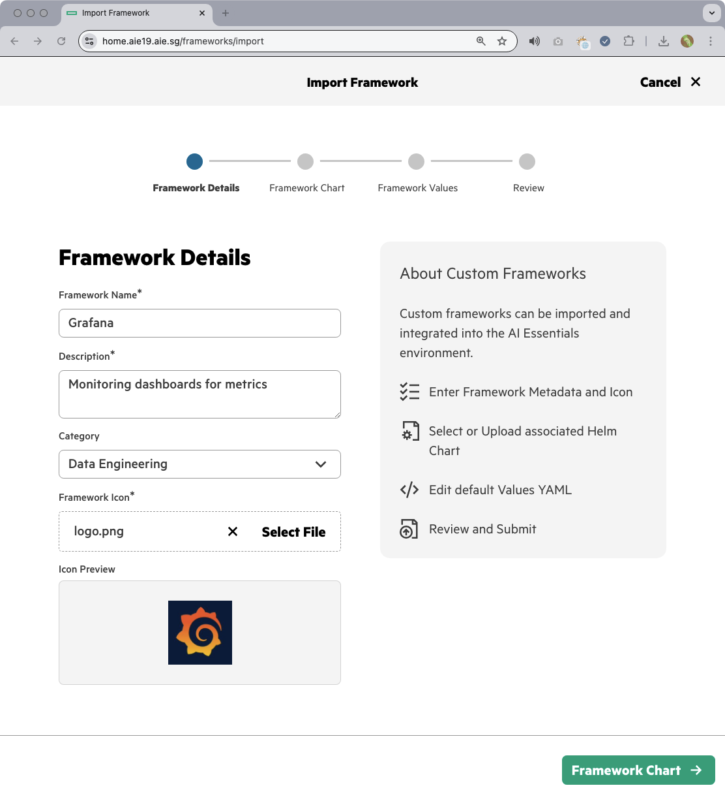
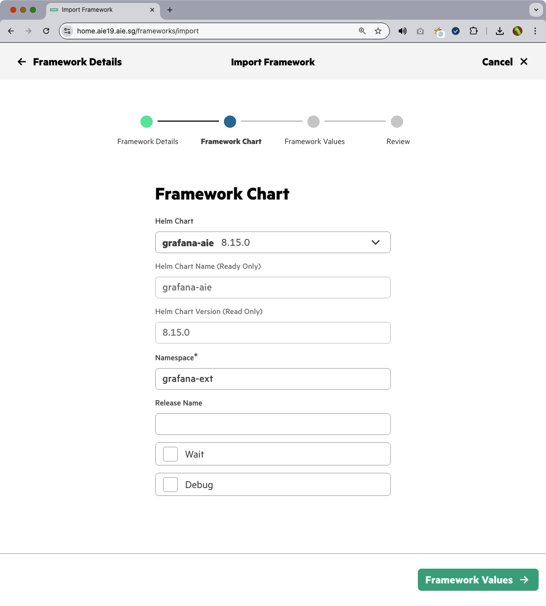
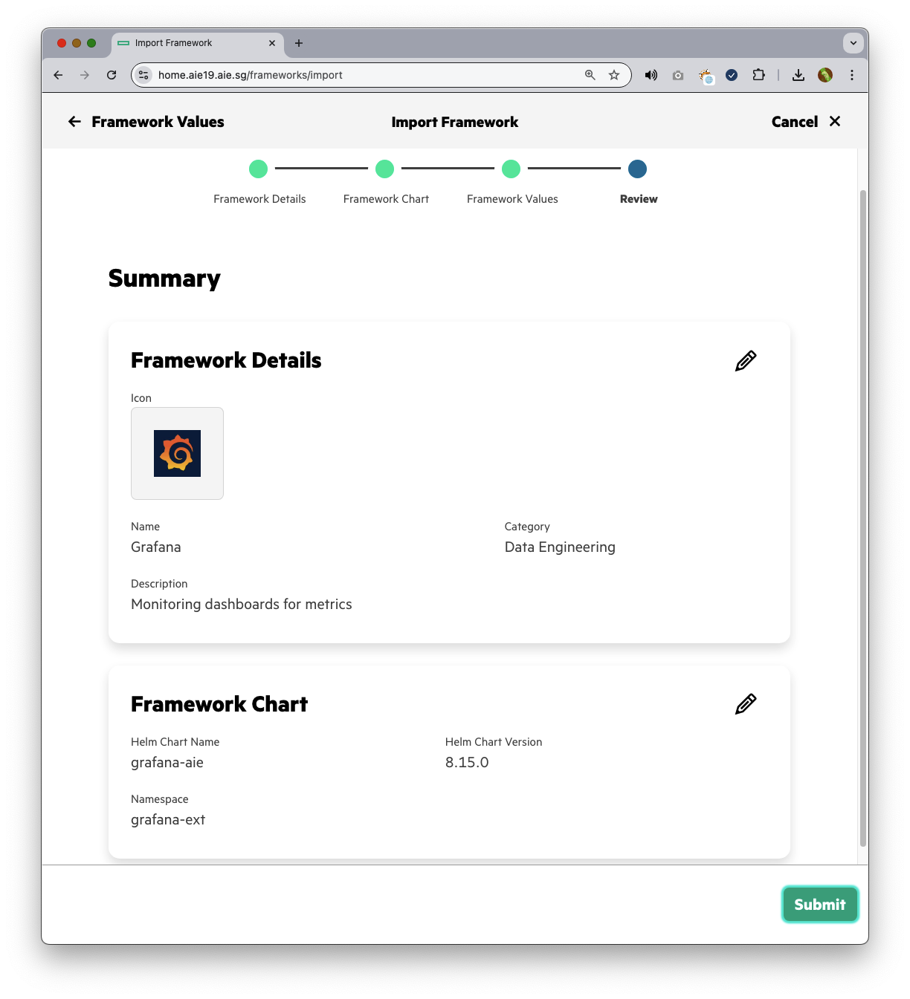
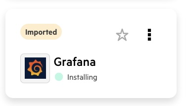
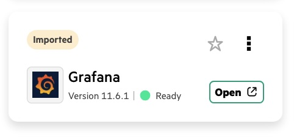

# Expose Prometheus in HPE Private Cloud AI 

## Purpose

HPE Private Cloud AI includes Prometheus for Monitoring. This receipe describes how to expose prometheus to be accessed from outside including Prometheus UI. The same exposed Prometheus endpoint can also be access via additional applications such as Grafana. This provides users ability to utilize metrics already collected to build their own dashboards.

## Process Overview

| Step | Action | Description |
| :--- | :--- | :--- |
| **Step 1** | Deploy Virtual Service | Deploy yaml via Admin access at Kubernetes layer |
| **Step 2** | Access Prometheus UI | Exposed service endpoint allows access to Prometheus UI |
| **Step 3** | Connect tools such as Grafana | Use tools such as Grafana to connect and use Prometheus data |
---

## Step 1: Deploy Virtual Service

Kubernetes Admin may deploy a Virtual Service at Istio Gateway to enable access to Prometheus UI from outside the appliance. 



Yaml may be formulated based on the below example.

```yaml
### Virtual Service Yaml

apiVersion: networking.istio.io/v1
kind: VirtualService
metadata:
  name: prometheus-vs
  namespace: ezdata-system
spec:
  gateways:
  - istio-system/ezaf-gateway
  hosts:
  - prometheus.aie19.aie.sg ### CHANGE to Domain of appliance and subdomain you prefer for prometheus
  http:
  - match:
    - uri:
        prefix: /
    route:
    - destination:
        host:  kubeprom-prometheus.prometheus.svc.cluster.local ### Validate service endpoint
        port:
          number: 9090 ### Validate service endpoint
### end
```

## Step 2: Access Prometheus UI

Once Virtual Service deployed, Prometheus UI is accessible for query from outside appliance. The subdomain will be the one configured in the Yaml file.




## Step 3: Connect tools such as Grafana

Grafana or similar tools can use this Prometheus end point to query metrics already collected. This provides users ability to connect and build operations dashboards that run outside the appliance.





Grafana may also be onboarded inside Private Cloud AI. This allows Grafana to use the Kubernetes internal service endpoint for Prometheus instead of external virtual service end-point.

The step by step import of Grafan is as below.






