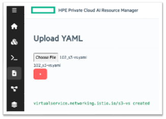

# S3-based data sharing from outside HPE Private Cloud AI 

## Purpose

This Istio Virtual Service refers to configuring in-built S3 object store to be accessed from outside for data-sharing.  It can be done by Admin of the platform via Kubernetes layer.

Data scientist facing interface is delivered by HPE AI Essentials which is a Kubernetes based system. It runs Istio Gateway to control access. Any service running internally can only be accessed from outside if Istio Gateway allows it. By default S3 object store inside Private Cloud AI is not accessible from outside. However, clients can choose to enable this external access for data sharing from external applications and systems. 

## Process Overview

| Step | Action | Description |
| :--- | :--- | :--- |
| **Step 1** | Deploy Virtual Service | Deploy yaml via Admin access at Kubernetes layer |
| **Step 2** | Generate Access Token | Use shell commands from outside appliance to generate access token |
| **Step 3** | Access internal S3 with standard tools | Access via any S3 compatible tools including AWS CLI from outside appliance |
---

## Step 1: Deploy Virtual Service

Kubernetes Admin may deploy a Virtual Service at Istio Gateway to enable access to S3 service from outside the appliance. 



Yaml may be formulated based on the below example.

```yaml
### Virtual Service Yaml

apiVersion: networking.istio.io/v1
kind: VirtualService
metadata:
  name: s3-vs
  namespace: ezdata-system
spec:
  gateways:
  - istio-system/ezaf-gateway
  hosts:
  - s3.aie19.aie.sg ### CHANGE to Domain of appliance and subdomain you prefer for S3
  http:
  - match:
    - uri:
        prefix: /
    route:
    - destination:
        host:  local-s3-service.ezdata-system.svc.cluster.local ### Validate service endpoint
        port:
          number: 30000  ### Validate service endpoint
### end
```

## Step 2: Generate Access Token

There are 3 tokens involved which add various layers of security:

- Secret Token - Kubernetes Admin controls it. **Authenticate** who can call virtual service.
- Refresh Token - User controls it and it inherits user level RBAC.  **Authorize** user-level RBAC access.
- Access Token - using both tokens above, users are able to generate **short-lived access tokens** 	and keep refreshing them periodically. Short lived tokens are the industry standard for security.

1. Get secret token from appliance Keycloak which is required to refresh user access token. Only Kubernetes Admin will be able to get this secret. Admins should only share this secret token with users on a need to know basis. This ensures that only authorized users are able to use this virtual service endpoint.

	```bash
	kubectl -n ezaddon-system get secret hpecp-bootstrap-authconfig \
	-o jsonpath='{.data.OIDC_CLIENT_SECRET}' | base64 -d

	export CLIENT_SECRET="xxxxxxxxxxxxxxxxxxx"

	```
1. Every user has their own Refresh Token. This is generated via user login and any necessary user 2FA. This adds second element of **user specific RBAC** as set in the system. The access to S3 object store is using this user's RBAC and can access only what this user is permitted to access. 
 
	```bash
	User visits from incognito browser to kick start authentication and download refresh token
	
	https://token-service.$APPLIANCE_DOMAIN/refresh-token-download
	
	export REFRESH_TOKEN="yyyyyyyyy"
	```
 	
 	Downloaded refresh token can be set in environment variable or used elsewhere.
 
1. Renew/create user access token and use for S3 access.

	```bash
  	export KC_ADDR="keycloak.$APPLIANCE_DOMAIN"
  	exoirt REFRESH_TOKEN="yyyyyyy"
  	export CLIENT_SECRET="xxxxxxx"
  	
	response_json=$(curl -k --data \
	"grant_type=refresh_token&client_id=ua&refresh_token=$REFRESH_TOKEN&client_secret=$CLIENT_SECRET" \
	https://$KC_ADDR/realms/UA/protocol/openid-connect/token)
	
	export ACCESS_TOKEN=$(echo "$response_json" | jq -r '.access_token')
	```


## Step 3: Access from outside with standard tools

Any S3 compatible tool may be used to access. Below example shows access mechanism using AWS S3 CLI. The certification check is supressed as this test appliance runs self-signed certificate.

 
```bash
$ export AWS_ACCESS_KEY_ID=$ACCESS_TOKEN
$ export AWS_SECRET_ACCESS_KEY=“s3”

$ aws s3 ls --endpoint https://s3.aie19.aie.sg --no-verify-ssl --recursive

2025-08-28 10:36:41 mlflow.sgaie
2025-08-28 21:40:22 sgaie-kfp

$ aws s3 ls s3://mlflow.sgaie --endpoint https://s3.aie19.aie.sg --no-verify-ssl --recursive

.....
2025-10-01 15:40:44      58430 4/traces/b79760399c0c4f108f3630ab3bad3cdc/artifacts/traces.json
2025-10-01 15:38:07      45280 4/traces/dbf34d60535c4f29b7366c1a81387aa8/artifacts/traces.json
2025-10-01 15:41:31      58436 4/traces/f516cd8c9c2b4e7da1167dd5e43cf5c2/artifacts/traces.json
2025-09-25 11:33:40      46533 5/15609d4b902241d981f0792627fc120d/artifacts/feature_importance.png
2025-09-25 11:33:40       1488 5/15609d4b902241d981f0792627fc120d/artifacts/model/MLmodel
2025-09-25 11:33:40        213 5/15609d4b902241d981f0792627fc120d/artifacts/model/conda.yaml
2025-09-25 11:33:40     878021 5/15609d4b902241d981f0792627fc120d/artifacts/model/model.pkl
.....

```

### Use provided script from external system to generate token

Run script from external system to get token generated and populated in environment variables. Subsequently issue AWS CLIs as needed to create buckets and upload files.

```bash
$ source ./102_s3_token_bash.sh ./2601-sgaie-refresh-token.txt keycloak.aie19.aie.sg

DEBUG: Filename detected: ./2601-sgaie-refresh-token.txt
DEBUG: Domain detected: keycloak.aie19.aie.sg
DEBUG: SECRET detected: A01wdSQbGVuMMErbf3Nxt5kf
Success: refresh_token loaded from ./2601-sgaie-refresh-token.txt

PCAI_ACCESS_TOKEN received: token is xxxxxxx
AWS secret and access key environment variables set. You may use AWS CLI now.
Process completed for domain: keycloak.aie19.aie.sg
```

Also set the below for compatibility of AWS CLI with non-AWS S3 compatible storage.

```bash
export AWS_REQUEST_CHECKSUM_CALCULATION="when_required"
export PYTHONWARNINGS="ignore:Unverified HTTPS request"
```

**List buckets**
 
```bash
$ aws s3 ls --endpoint https://s3.aie19.aie.sg --no-verify-ssl

2025-08-28 10:36:41 mlflow.sgaie
2025-08-28 21:40:22 sgaie-kfp
```
**Create bucket**

```bash
$ aws s3 mb s3://ingest-bucket-1 \
    --endpoint https://s3.aie19.aie.sg \
    --no-verify-ssl

make_bucket: ingest-bucket-1

$ aws s3 ls --endpoint https://s3.aie19.aie.sg --no-verify-ssl

2026-01-18 11:21:52 ingest-bucket-1 <<<<<<<
2025-08-28 10:36:41 mlflow.sgaie
2025-08-28 21:40:22 sgaie-kfp

```


**Upload file**

```bash
$ aws s3 cp 102_s3_token_bash.sh s3://ingest-bucket-2/ \
    --endpoint https://s3.aie19.aie.sg \
    --no-verify-ssl

upload: ./102_s3_token_bash.sh to s3://ingest-bucket-1/102_s3_token_bash.sh

$ aws s3 ls s3://ingest-bucket-1/ \
    --endpoint https://s3.aie19.aie.sg \
    --no-verify-ssl --recursive

2026-01-18 12:18:37       2044 102_s3_token_bash.sh <<<<<<<

```

