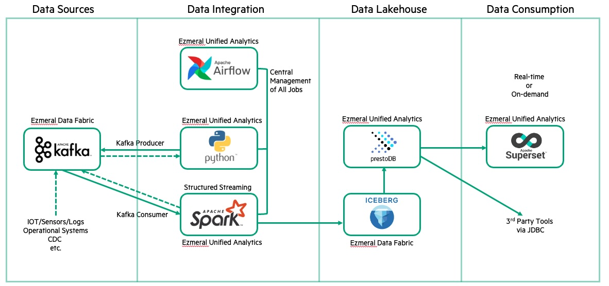

# Ezmeral

This is Harshal Patil's eclectic collection of code bits run on Ezmeral Data Fabric and Ezmeral Unified Analytics.

Covers topics :

* Apache Spark
* Apache Airflow
* Apache Iceberg
* Presto
* Superset
* Streaming / Kafka
* Batch
* Data Fabric 
* AI / ML / MLOps
* etc.

 

 

