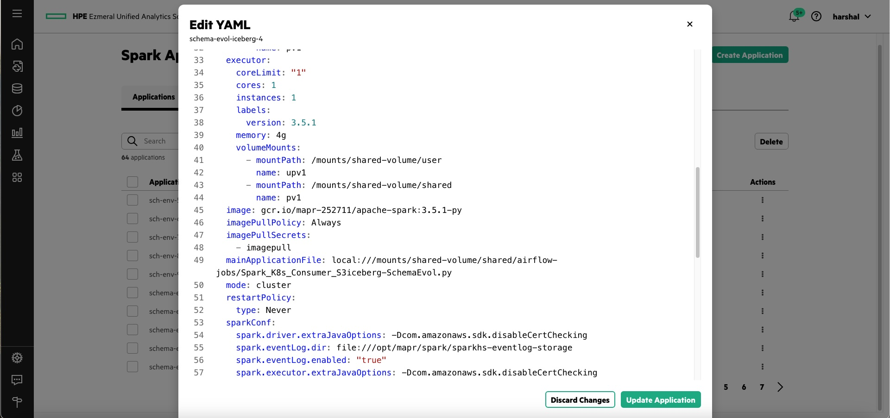

# S3 Connectivity from Spark Open-Source (OSS) image in UA 1.5
#### Sparkconf for S3 direct connectivity from Spark on K8s OSS image in UA 1.5. Add this sparkconf to your Spark on K8s yaml 
#### These instructions are to work with EDF S3 object store with self-signed cert. This is how it will be installed in POC setup.


1) Find existing sparkconf in the YAML auto generated by UI via edit option in UI




```
sparkConf:
```

2) Set this flag to eliminate SSL errors which will be due to the self-signed certificate not being present in your image's JAVA cert store. This setting is critical. Also ensure it is set exactly as is below. It is not supposed to have a value such as "true". It is a flag as per AWS documentation. 


```
    spark.driver.extraJavaOptions: -Dcom.amazonaws.sdk.disableCertChecking
    spark.executor.extraJavaOptions: -Dcom.amazonaws.sdk.disableCertChecking
```
    
3) Set additional flags to configure S3 endpoint 


```
    spark.hadoop.fs.s3a.connection.ssl.enabled: "true"
    spark.hadoop.fs.s3a.endpoint: https://<IP>:<port> 
    spark.hadoop.fs.s3a.impl: org.apache.hadoop.fs.s3a.S3AFileSystem
    spark.hadoop.fs.s3a.path.style.access: "true"
    spark.executorEnv.AWS_ACCESS_KEY_ID: <access>
    spark.executorEnv.AWS_SECRET_ACCESS_KEY: <secret>
    spark.kubernetes.driverEnv.AWS_ACCESS_KEY_ID: <access>
    spark.kubernetes.driverEnv.AWS_SECRET_ACCESS_KEY: <secret>
```    

4) To take the S3 credentials from Environment Variables defined from Kubernetes secret, use the below. Before using this define your secret in your user namespace. In below example, spark-oss-secret is the name of the secret.


```yaml
 sparkConf:
 ...
 
    spark.hadoop.fs.s3a.endpoint: https://<IP Endpoint>:<port>
    spark.kubernetes.driver.secretKeyRef.AWS_ACCESS_KEY_ID: spark-oss-secret:AWS_ACCESS_KEY_ID
    spark.kubernetes.driver.secretKeyRef.AWS_SECRET_ACCESS_KEY: spark-oss-secret:AWS_SECRET_ACCESS_KEY
    spark.kubernetes.executor.secretKeyRef.AWS_ACCESS_KEY_ID: spark-oss-secret:AWS_ACCESS_KEY_ID
    spark.kubernetes.executor.secretKeyRef.AWS_SECRET_ACCESS_KEY: spark-oss-secret:AWS_SECRET_ACCESS_KEY

 ...
```

Below is one example of how Environment Variable defined from Kubernetes secret is available in Spark image.


    