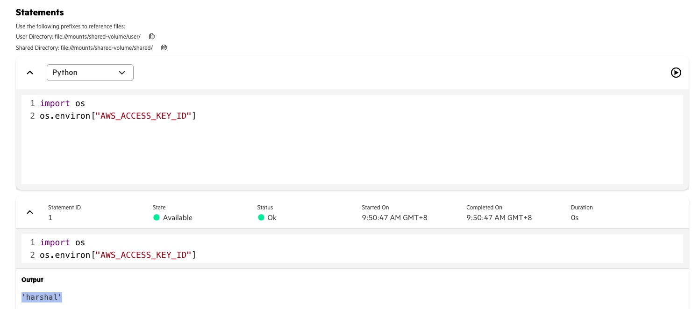

# Use Kubernetes Secret to pass S3 access credentials to Spark on K8s
#### This document shows how to use Kubernetes defined secret to provide S3 access credentials to Spark. 
#### The method used is to define environment variables expected by Spark in both driver and executor pods from value in secret. 
Link: [https://spark.apache.org/docs/latest/running-on-kubernetes.html#secret-management](https://spark.apache.org/docs/latest/running-on-kubernetes.html#secret-management) 

<br>

1) Create this secret in default user namespace in UA 1.5. In previous UA version, this may need to be created in spark namespace instead. 

Substitue actual values in yaml. Instead of stringData, you may choose to use data and then provide base64 encoded value instead of plain text. 

<br>

```yaml
apiVersion: v1
kind: Secret
metadata:
  name: spark-test-secret
type: Opaque
stringData:
   AWS_ACCESS_KEY_ID: "harshal"
   AWS_SECRET_ACCESS_KEY: "patil"
```   

<br>

2) Provide sparkconf while launching Spark jobs. This is entered in the Spark job submission yaml.

<br>

```yaml
sparkConf:
....... 
spark.kubernetes.driver.secretKeyRef.AWS_ACCESS_KEY_ID : spark-test-secret:AWS_ACCESS_KEY_ID
spark.kubernetes.driver.secretKeyRef.AWS_SECRET_ACCESS_KEY : spark-test-secret:AWS_SECRET_ACCESS_KEY
spark.kubernetes.executor.secretKeyRef.AWS_ACCESS_KEY_ID : spark-test-secret:AWS_ACCESS_KEY_ID
spark.kubernetes.executor.secretKeyRef.AWS_SECRET_ACCESS_KEY : spark-test-secret:AWS_SECRET_ACCESS_KEY
.......
```   
<br>

3) Value from secret is available as environment variable to Spark on K8s code

<br>

 

<br>

