# Spark on K8s Kafka Consumer to Write Iceberg Table

 

##### This is a Kafka Consumer details that reads from Kafka Topic and writes to Iceberg table in Object Store
##### The object store is S3 compatible object atore on Ezmeral Data Fabric
##### The Kafka Consumer is running under Spark on K8s on Ezmeral Unified Analytics

 

###### 1. Running Spark on K8s Consumer via Ezmeral Unified Analytics (UA) UI

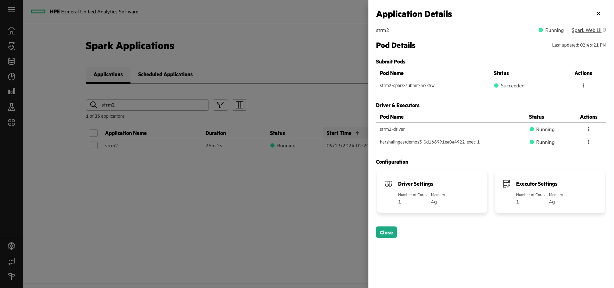 

###### 2. Spark History Server view of running Streaming Application

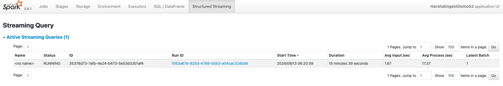 

###### 3. Spark History Server details of running Streaming Application

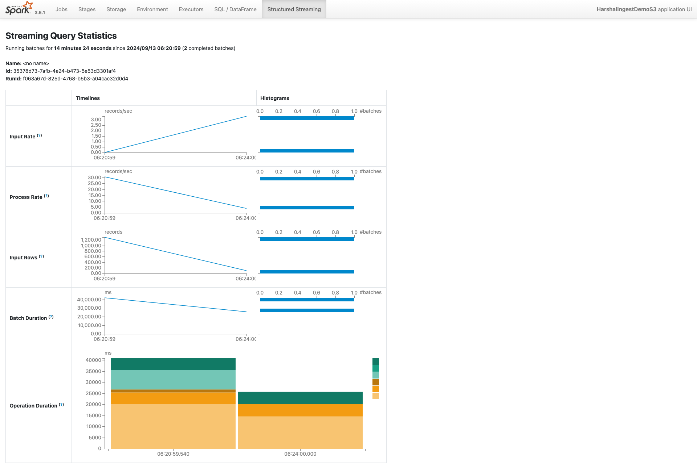 

###### 4. Iceberg Table in S3 bucket

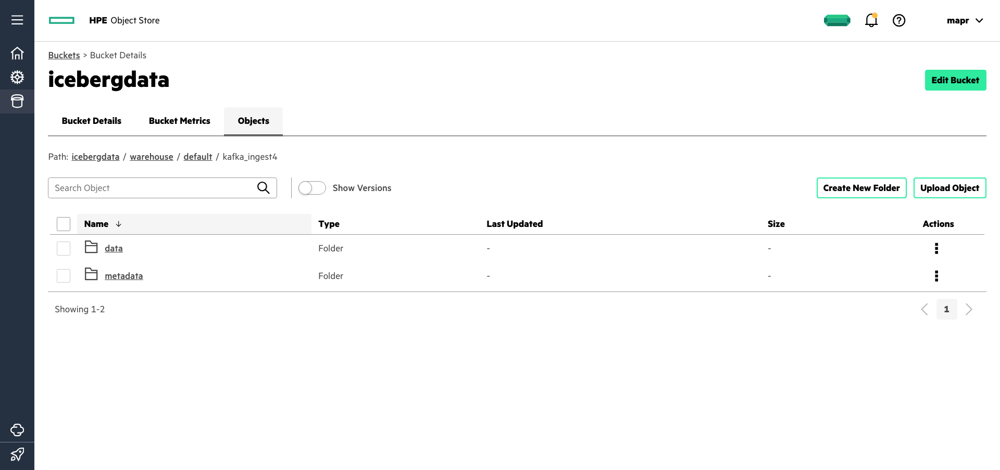

###### 5. Iceberg Table in S3 bucket - Table Metadata

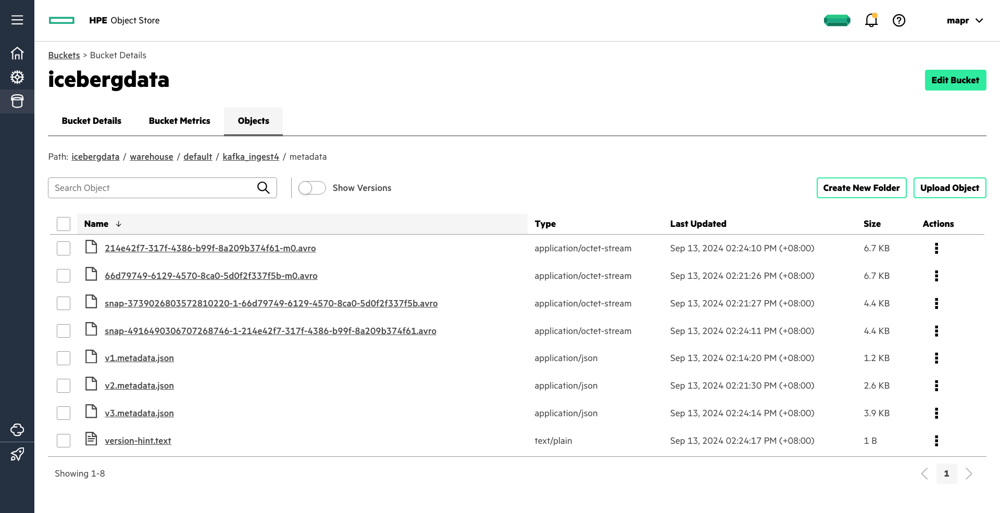

###### 6. Iceberg Table in S3 bucket - Table Data

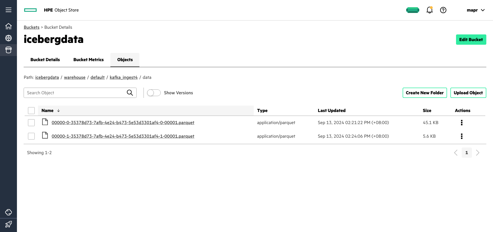

###### 7. Iceberg Table in S3 bucket - Checkpoints

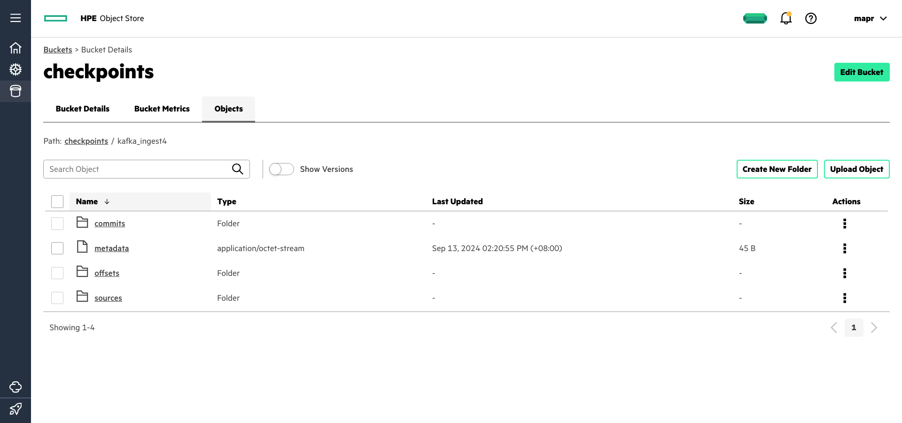

###### 8. Iceberg Table in S3 bucket - Commits

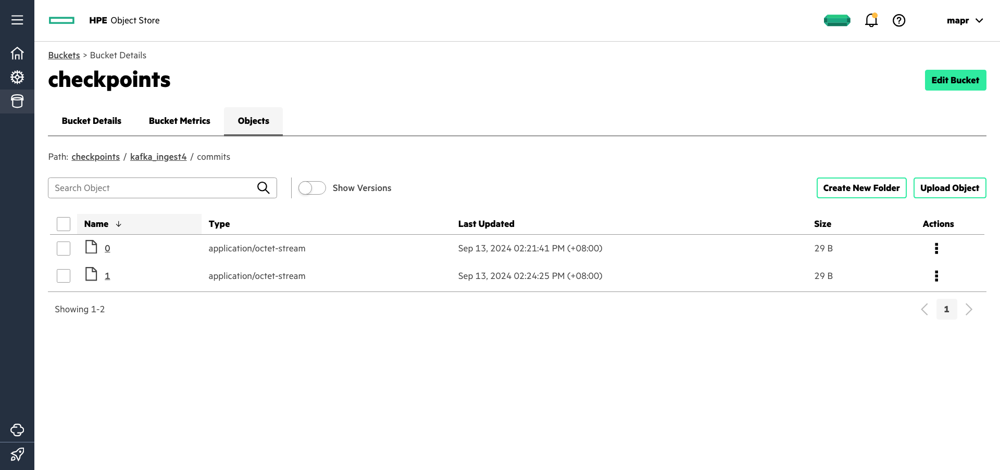

###### 9. Presto connected to Iceberg Table in S3 bucket

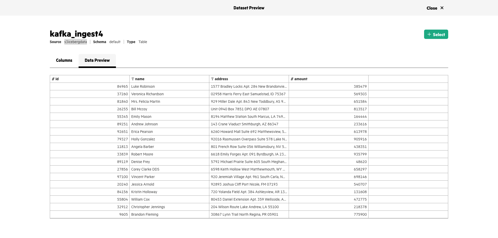

###### 10. Presto connected to Iceberg Table in S3 bucket - read Iceberg Snapshots present in table

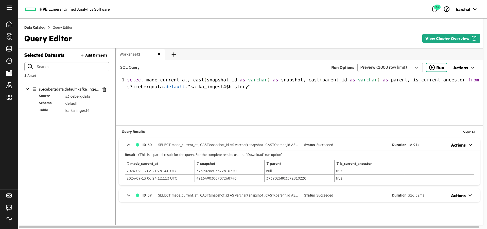

###### 11. Presto connected to Iceberg Table in S3 bucket - Select data from Iceberg table

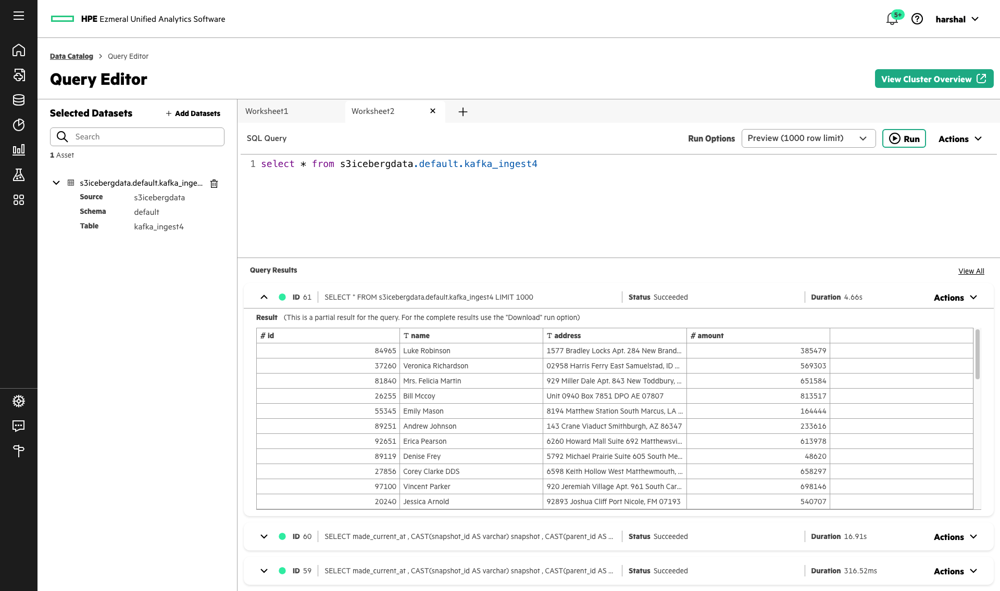

###### 12. Superset connected to Presto which is in-turn connected to Iceberg Table in S3 bucket

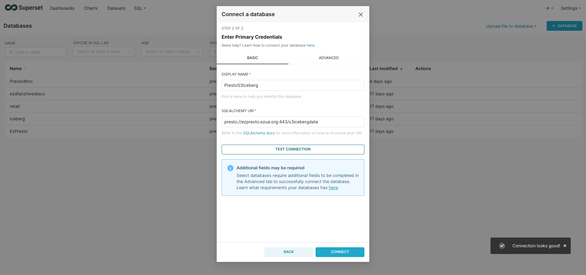

###### 13. Superset can query to Presto which is in-turn connected to Iceberg Table in S3 bucket

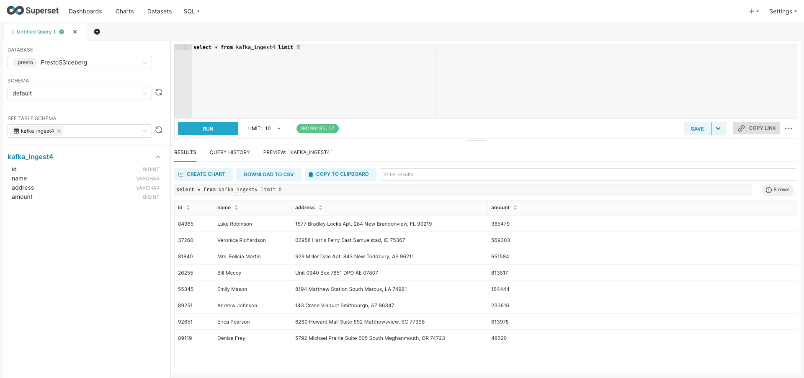

###### 14. Superset Real-Time Dashboard - KPIs update each 30 second based on Streaming Data 

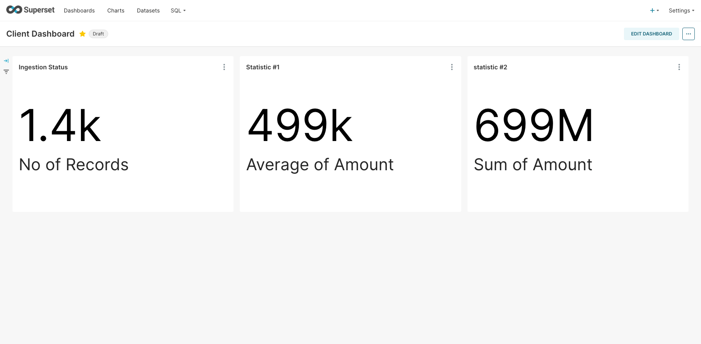

